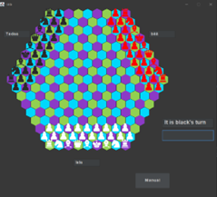

# HexaChess

HexaChess is a novel chess variant played on a hexagonal board, offering a fresh twist on the classic game of strategy. Written in Java with Swing for the graphical user interface, it combines traditional chess elements with new tactical possibilities, enhanced by the unique hexagonal geometry of the board.

## Features

- **Innovative Gameplay**: Experience chess from a whole new perspective on a hexagonal board.
- **Java Swing GUI**: A robust and responsive user interface for smooth gameplay.
- **Multiplayer Support**: Play against friends or online opponents.
- **Score Tracking**: Keep track of your high scores and improve your strategy.

## Showcase

## License
This project is licensed under the MIT License - see the LICENSE.md file for details.